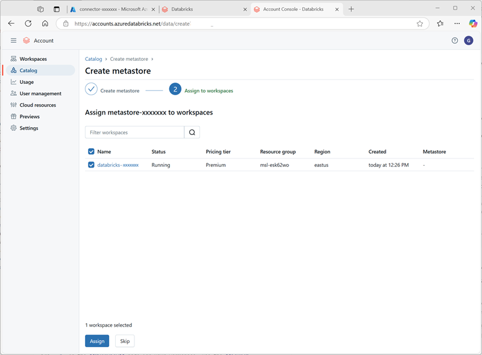

---
lab:
  title: "Explorer Unity\_Catalog dans Azure\_Databricks"
---

# Explorer Unity Catalog dans Azure Databricks

Unity Catalog propose une solution de gouvernance centralisée pour les données et l’IA, qui simplifie la sécurité et la gouvernance en fournissant un emplacement unique pour administrer et auditer l’accès aux données. Dans cet exercice, vous allez configurer Unity Catalog pour un espace de travail Azure Databricks et l’utiliser pour gérer les données.

> **Note** : dans certains cas, Unity Catalog peut déjà être activé pour votre espace de travail. Vous pouvez toujours suivre les étapes de cet exercice pour attribuer un nouveau compte de stockage à votre catalogue.

Ce labo prend environ **45** minutes.

> **Remarque** : l’interface utilisateur d’Azure Databricks est soumise à une amélioration continue. Elle a donc peut-être changé depuis l’écriture des instructions de cet exercice.

## Avant de commencer

Vous avez besoin d’un [abonnement Azure](https://azure.microsoft.com/free) dans lequel vous avez des droits d’<u>administrateur général</u>.

> **IMPORTANT** : cet exercice suppose que vous disposez de droits d’*administrateur général* dans votre abonnement Azure. Ce niveau d’accès est requis pour gérer le compte Databricks afin d’activer Unity Catalog dans un espace de travail Azure Databricks.

## Créer un espace de travail Azure Databricks

> **Conseil** : si vous disposez déjà d’un espace de travail Azure Databricks de niveau Premium, vous pouvez ignorer cette procédure et utiliser votre espace de travail existant.

1. Connectez-vous au **portail Azure** à l’adresse `https://portal.azure.com`.
2. Créez une ressource **Azure Databricks** avec les paramètres suivants :
    - **Abonnement** : *Sélectionnez votre abonnement Azure*.
    - **Groupe de ressources** : *créez un groupe de ressources nommé `msl-xxxxxxx` (où « xxxxxxx » est une valeur unique)*.
    - **Nom de l’espace de travail** : `databricks-xxxxxxx`*(où « xxxxxxx » est la valeur utilisée dans le nom du groupe de ressources)*
    - **Région** : *sélectionnez une région disponible*.
    - **Niveau tarifaire** : *Premium* ou *Évaluation*
    - **Nom du groupe de ressources managées** : `databricks-xxxxxxx-managed`*(où « xxxxxxx » est la valeur utilisée dans le nom du groupe de ressources)*

    

3. Sélectionnez **Examiner et créer**, puis attendez la fin du déploiement.

## Préparer le stockage pour le catalogue

Lorsque vous utilisez Unity Catalog dans Azure Databricks, les données sont stockées dans un magasin externe, qui peut être partagé entre plusieurs espaces de travail. Dans Azure, il est courant d’utiliser un compte de stockage Azure prenant en charge un espace de noms hiérarchique Azure Data Lake Storage Gen2 à cet effet.

1. Dans le portail Azure, créez une ressource de **compte de stockage** avec les paramètres suivants :
    - **Paramètres de base**:
        - **Abonnement** : *Sélectionnez votre abonnement Azure*.
        - **Groupe de ressources** : *sélectionnez le groupe de ressources **msl-xxxxxxx** existant dans lequel vous avez créé l’espace de travail Azure Databricks.*
        - **Nom du compte de stockage** : `storexxxxxxx`*(où « xxxxxxx » est la valeur utilisée dans le nom du groupe de ressources)*
        - **Région** : *sélectionnez la <u>région où vous avez créé l’espace de travail Azure Databricks</u>.*
        - **Service principal** : stockage Blob Azure ou Azure Data Lake Storage Gen2
        - **Performances** : standard
        - **Redondance** : stockage localement redondant (LRS) *(pour une solution hors production comme cet exercice, cette option offre des avantages en termes de coût et de consommation de capacité)*
    - **Avancé** :
        - **Activer l’espace de noms hiérarchique** :*sélectionné*
    
    

1. Sélectionnez **Examiner et créer**, puis attendez la fin du déploiement.
1. Une fois le déploiement terminé, accédez à la ressource de compte de stockage *storexxxxxxx* déployée et utilisez sa page de **navigateur stockage** pour ajouter un nouveau conteneur d’objets blob nommé `data`. C’est là que les données de vos objets Unity Catalog seront stockées.

    

## Configurer l’accès au stockage du catalogue

Pour accéder au conteneur d’objets blob que vous avez créé pour Unity Catalog, votre espace de travail Azure Databricks doit utiliser un compte managé pour se connecter au compte de stockage via un *connecteur d’accès*.

1. Dans le portail Azure, créez un **connecteur d’accès pour la ressource Azure Databricks** avec les paramètres suivants :
    - **Abonnement** : *Sélectionnez votre abonnement Azure*.
    - **Groupe de ressources** : *sélectionnez le groupe de ressources **msl-xxxxxxx** existant dans lequel vous avez créé l’espace de travail Azure Databricks.*
    - **Nom** : `connector-xxxxxxx`*(où « xxxxxxx » est la valeur utilisée dans le nom du groupe de ressources)*
    - **Région** : *sélectionnez la <u>région où vous avez créé l’espace de travail Azure Databricks</u>.*

    

1. Sélectionnez **Examiner et créer**, puis attendez la fin du déploiement. Accédez ensuite à la ressource déployée et, dans la page **Vue d’ensemble**, notez l’**ID de la ressource**, qui doit être au format */subscriptions/abc-123.../resourceGroups/msl-xxxxxxx/providers/Microsoft.Databricks/accessConnectors/connector-xxxxxxx*. Vous en aurez besoin plus tard.
1. Dans le portail Azure, revenez à la ressource de compte de stockage *storexxxxxxx* et, dans la page **Contrôle d’accès (IAM)**, ajoutez une nouvelle attribution de rôle.
1. Dans la liste **rôles de fonction de tâche**, recherchez et sélectionnez le rôle `Storage blob data contributor`.

    

1. Cliquez sur **Suivant**. Ensuite, dans la page **Membres**, sélectionnez l’option permettant d’attribuer l’accès à une **identité managée**, puis recherchez et sélectionnez le connecteur d’accès `connector-xxxxxxx` pour Azure Databricks que vous avez créé précédemment (vous pouvez ignorer les autres connecteurs d’accès créés dans votre abonnement).

    

1. Passez en revue et attribuez l’appartenance au rôle afin d’ajouter l’identité managée de votre connecteur d’accès *connector-xxxxxxx* pour Azure Databricks au rôle Collaborateur de données BLOB de stockage pour votre compte de stockage *storexxxxxxx*, ce qui lui permet d’accéder aux données dans le compte de stockage.

## Configurer Unity Catalog

Maintenant que vous avez créé un conteneur de stockage Blob pour votre catalogue et fourni un moyen pour une identité managée Azure Databricks d’y accéder, vous pouvez configurer Unity Catalog pour utiliser un metastore basé sur votre compte de stockage.

1. Dans le portail Azure, affichez le groupe de ressources **msl-*xxxxxxx***, qui doit maintenant contenir trois ressources :
    - Espace de travail Azure Databricks **databricks-*xxxxxxx*** 
    - Compte de stockage **store*xxxxxxx***
    - Connecteur d’accès **connector-*xxxxxxx*** pour Azure Databricks

1. Dans la ressource d’espace de travail Azure Databricks **databricks-xxxxxxx** que vous avez créée précédemment, sur la page **Vue d’ensemble**, utilisez le bouton **Lancer l’espace de travail** pour ouvrir votre espace de travail Azure Databricks dans un nouvel onglet de navigateur, puis connectez-vous si vous y êtes invité.
1. Dans le menu **databricks-*xxxxxxx*** en haut à droite, sélectionnez **Gérer le compte** pour ouvrir la console de compte Azure Databricks dans un autre onglet.

    

    > **Note** : si ***Gérer le compte*** n’est pas répertorié ou ne s’ouvre pas correctement, il se peut qu’un administrateur général doivent ajouter le rôle ***Administrateur de compte*** à votre compte dans votre espace de travail Azure Databricks.
    >
    > Si vous utilisez un abonnement Azure personnel que vous avez créé à l’aide d’un compte Microsoft personnel (par exemple, un compte oultook.com), un compte Entra ID « externe » a peut-être été créé automatiquement dans votre répertoire Azure et vous devrez peut-être vous connecter à l’aide de ce nom de compte.
    >
    > Consultez ***[ce thread de questions et réponses](https://learn.microsoft.com/answers/questions/2133569/not-able-to-access-databricks-manage-account-conso)*** pour obtenir de l’aide.

1. Dans la console de compte Azure Databricks, dans la page de **catalogue**, sélectionnez **Créer un metastore**.
1. Créez un metastore avec les paramètres suivants :
    - **Nom** : `metastore-xxxxxxx`*(où xxxxxxx est la valeur unique que vous avez utilisée pour les ressources dans cet exercice)*
    - **Région** : *sélectionnez la région dans laquelle vous avez créé vos ressources Azure*.
    - **Chemin d’accès ADLS Gen 2** : `data@storexxxxxxx.dfs.core.windows.net/`*(où storexxxxxx est le nom de votre compte de stockage)*
    - **ID du connecteur d’accès** : *ID de ressource de votre connecteur d’accès (copié à partir de sa page Vue d’ensemble dans le portail Azure)*

    

1. Après avoir créé le metastore, sélectionnez l’espace de travail **databricks-*xxxxxxx*** et attribuez-lui le metastore.

    

## Utiliser des données dans Unity Catalog

Maintenant que vous avez attribué un metastore éternel et activé Unity Catalog, vous pouvez l’utiliser pour travailler avec des données dans Azure Databricks.

### Créer et charger une table

1. Fermez l’onglet du navigateur de la console de compte Azure Databricks et revenez à l’onglet de votre espace de trvail Azure Databricks. <u>Actualisez ensuite le navigateur</u>.
1. Dans la page **Catalogue**, sélectionnez le catalogue **principal** de votre organisation et notez que les schémas nommés **default** et **Information_schema** ont déjà été créés dans votre catalogue.

    

1. Sélectionnez **Créer un schéma** et créez un schéma nommé `sales` (ne renseignez pas l’emplacement de stockage afin que le metastore par défaut du catalogue soit utilisé).
1. Dans un nouvel onglet de navigateur, téléchargez le fichier [**products.csv**](https://raw.githubusercontent.com/MicrosoftLearning/mslearn-databricks/main/data/products.csv) à partir de `https://raw.githubusercontent.com/MicrosoftLearning/mslearn-databricks/main/data/products.csv` vers votre ordinateur local, en l’enregistrant en tant que **products.csv**.
1. Dans l’Explorateur catalogue de l’espace de travail Azure Databricks, avec le schéma des **ventes** sélectionné, sélectionnez **Créer** > **Créer une table**. Chargez ensuite le fichier **products.csv** que vous avez téléchargé pour créer une table nommée **product** dans le schéma des **ventes**.

    > **Note** : vous devrez peut-être attendre quelques minutes pour que le calcul serverless démarre.

    

1. Créez la table . Si une description générée par l’IA est suggérée, acceptez-la.

### Gérer les autorisations

1. Une fois la table **products** sélectionnée, dans l’onglet **Autorisations**, vérifiez qu’aucune autorisation n’est attribuée par défaut pour la nouvelle table (vous pouvez y accéder, car vous disposez de droits d’administration complets, mais aucun autre utilisateur ne peut interroger la table).
1. Sélectionnez **Accorder** et configurez l’accès à la table comme suit :
    - **Principaux** : tous les utilisateurs de compte
    - **Privilèges** : SELECT
    - **Privilèges supplémentaires requis pour l’accès** : accordez également USE SCHEMA sur main.sales

    

### Suivre la traçabilité

1. Dans le menu **+Nouveau**, sélectionnez **Requête** et créez une requête avec le code SQL suivant :

    ```sql
    SELECT Category, COUNT(*) AS Number_of_Products
    FROM main.sales.products
    GROUP BY Category; 
    ```

1. Vérifiez que le calcul serverless est connecté et exécutez la requête pour afficher les résultats.

    

1. Enregistrez la requête comme `Products by Category` dans le dossier de l’espace de travail de votre compte d’utilisateur Azure Databricks.
1. Revenez à la page **Catalogue**. Développez ensuite le catalogue **principal** et le schéma des** ventes**, puis sélectionnez la table **produits**.
1. Dans l’onglet **Traçabilité**, sélectionnez **Requêtes** pour vérifier que la traçabilité de la requête que vous avez créée dans la table source a été suivie par Unity Catalog.

    

## Nettoyage

Dans cet exercice, vous avez activé et configuré Unity Catalog pour un espace de travail Azure Databricks et l’avez utilisé pour travailler avec des données dans un metastore. Pour en savoir plus sur ce que vous pouvez faire avec Unity Catalog dans Azure Databricks, consultez [Gouvernance des données avec Unity Catalog](https://learn.microsoft.com/azure/databricks/data-governance/).

Si vous avez terminé d’explorer Azure Databricks, vous pouvez supprimer les ressources que vous avez créées pour éviter les coûts Azure inutiles et libérer de la capacité dans votre abonnement.
