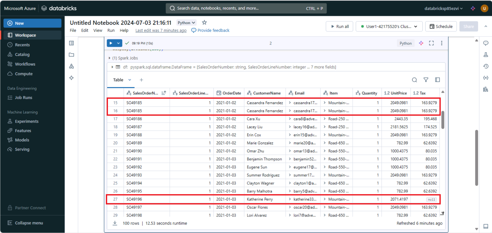

---
lab:
  title: Transformer des données avec Apache Spark dans Azure Databricks
---

# Transformer des données avec Apache Spark dans Azure Databricks

Azure Databricks est une version basée sur Microsoft Azure de la plateforme Databricks open source reconnue. 

Azure Databricks repose sur Apache Spark et offre une solution hautement évolutive pour les tâches d’ingénierie et d’analyse des données qui impliquent l’utilisation de données dans des fichiers.

Les tâches courantes de transformation de données dans Azure Databricks incluent le nettoyage des données, l’exécution d’agrégations et le cast de types. Ces transformations sont essentielles pour préparer des données à des fins d’analyse et font partie du processus ETL (Extract, Transform, Load) plus large.

Cet exercice devrait prendre environ **30** minutes.

## Provisionner un espace de travail Azure Databricks

> **Conseil** : Si vous disposez déjà d’un espace de travail Azure Databricks, vous pouvez ignorer cette procédure et utiliser votre espace de travail existant.

Cet exercice inclut un script permettant d’approvisionner un nouvel espace de travail Azure Databricks. Le script tente de créer une ressource d’espace de travail Azure Databricks de niveau *Premium* dans une région dans laquelle votre abonnement Azure dispose d’un quota suffisant pour les cœurs de calcul requis dans cet exercice ; et suppose que votre compte d’utilisateur dispose des autorisations suffisantes dans l’abonnement pour créer une ressource d’espace de travail Azure Databricks. Si le script échoue en raison d’un quota insuffisant ou d’autorisations insuffisantes, vous pouvez essayer de [créer un espace de travail Azure Databricks de manière interactive dans le portail Azure](https://learn.microsoft.com/azure/databricks/getting-started/#--create-an-azure-databricks-workspace).

1. Dans un navigateur web, connectez-vous au [portail Azure](https://portal.azure.com) à l’adresse `https://portal.azure.com`.
2. Utilisez le bouton **[\>_]** à droite de la barre de recherche, en haut de la page, pour créer un environnement Cloud Shell dans le portail Azure, en sélectionnant un environnement ***PowerShell*** et en créant le stockage si vous y êtes invité. Cloud Shell fournit une interface de ligne de commande dans un volet situé en bas du portail Azure, comme illustré ici :

    

    > **Remarque** : Si vous avez déjà créé une instance de Cloud Shell qui utilise un environnement *Bash*, utilisez le menu déroulant en haut à gauche du volet Cloud Shell pour passer à ***PowerShell***.

3. Notez que vous pouvez redimensionner le volet Cloud Shell en faisant glisser la barre de séparation en haut du volet. Vous pouvez aussi utiliser les icônes **&#8212;** , **&#9723;** et **X** situées en haut à droite du volet pour réduire, agrandir et fermer le volet. Pour plus d’informations sur l’utilisation d’Azure Cloud Shell, consultez la [documentation Azure Cloud Shell](https://docs.microsoft.com/azure/cloud-shell/overview).

4. Dans le volet PowerShell, entrez les commandes suivantes pour cloner ce référentiel :

    ```
    rm -r mslearn-databricks -f
    git clone https://github.com/MicrosoftLearning/mslearn-databricks
    ```

5. Une fois le référentiel cloné, entrez la commande suivante pour exécuter le script **setup.ps1**, qui approvisionne un espace de travail Azure Databricks dans une région disponible :

    ```
    ./mslearn-databricks/setup.ps1
    ```

6. Si vous y êtes invité, choisissez l’abonnement à utiliser (uniquement si vous avez accès à plusieurs abonnements Azure).
7. Attendez que le script se termine. Cette opération prend généralement environ 5 minutes, mais dans certains cas, elle peut être plus longue. Pendant que vous attendez, consultez l’article [Analyse exploratoire des données dans Azure Databricks](https://learn.microsoft.com/azure/databricks/exploratory-data-analysis/) dans la documentation Azure Databricks.

## Créer un cluster

Azure Databricks est une plateforme de traitement distribuée qui utilise des *clusters Apache Spark* pour traiter des données en parallèle sur plusieurs nœuds. Chaque cluster se compose d’un nœud de pilote pour coordonner le travail et les nœuds Worker pour effectuer des tâches de traitement. Dans cet exercice, vous allez créer un cluster à *nœud unique* pour réduire les ressources de calcul utilisées dans l’environnement du labo (dans lequel les ressources peuvent être limitées). Dans un environnement de production, vous créez généralement un cluster avec plusieurs nœuds Worker.

> **Conseil** : Si vous disposez déjà d’un cluster avec une version 13.3 LTS ou ultérieure du runtime dans votre espace de travail Azure Databricks, vous pouvez l’utiliser pour effectuer cet exercice et ignorer cette procédure.

1. Dans le Portail Microsoft Azure, accédez au groupe de ressources **msl-*xxxxxxx*** créé par le script (ou le groupe de ressources contenant votre espace de travail Azure Databricks existant)
2. Sélectionnez votre ressource de service Azure Databricks (nommée **databricks-*xxxxxxx*** si vous avez utilisé le script d’installation pour la créer).
3. Dans la page **Vue d’ensemble** de votre espace de travail, utilisez le bouton **Lancer l’espace de travail** pour ouvrir votre espace de travail Azure Databricks dans un nouvel onglet de navigateur et connectez-vous si vous y êtes invité.

    > **Conseil** : lorsque vous utilisez le portail de l’espace de travail Databricks, plusieurs conseils et notifications peuvent s’afficher. Ignorez-les et suivez les instructions fournies pour effectuer les tâches de cet exercice.

4. Dans la barre latérale située à gauche, sélectionnez la tâche **(+) Nouveau**, puis sélectionnez **Cluster**.
5. Dans la page **Nouveau cluster**, créez un cluster avec les paramètres suivants :
    - **Nom du cluster** : cluster de *nom d’utilisateur* (nom de cluster par défaut)
    - **Stratégie** : Non restreint
    - **Mode cluster** : nœud unique
    - **Mode d’accès** : un seul utilisateur (*avec votre compte d’utilisateur sélectionné*)
    - **Version du runtime Databricks** : 13.3 LTS (Spark 3.4.1, Scala 2.12) ou version ultérieure
    - **Utiliser l’accélération photon** : sélectionné
    - **Type de nœud** : Standard_D4ds_v5
    - **Arrêter après** *20* **minutes d’inactivité**

6. Attendez que le cluster soit créé. Cette opération peut prendre une à deux minutes.

> **Remarque** : si votre cluster ne démarre pas, le quota de votre abonnement est peut-être insuffisant dans la région où votre espace de travail Azure Databricks est approvisionné. Pour plus d’informations, consultez l’article [La limite de cœurs du processeur empêche la création du cluster](https://docs.microsoft.com/azure/databricks/kb/clusters/azure-core-limit). Si cela se produit, vous pouvez essayer de supprimer votre espace de travail et d’en créer un dans une autre région. Vous pouvez spécifier une région comme paramètre pour le script d’installation comme suit : `./mslearn-databricks/setup.ps1 eastus`

## Créer un notebook

1. Dans la barre latérale, cliquez sur le lien **(+) Nouveau** pour créer un **notebook**.

2. Remplacez le nom de notebook par défaut (**Notebook sans titre *[date]***) par `Transform data with Spark`, puis dans la liste déroulante **Connexion**, sélectionnez votre cluster s’il n’est pas déjà sélectionné. Si le cluster n’est pas en cours d’exécution, le démarrage peut prendre une minute.

## Ingérer des données

1. Dans la première cellule du notebook, entrez le code suivant, qui utilise des commandes du *shell* pour télécharger des fichiers de données depuis GitHub dans le système de fichiers utilisé par votre cluster.

     ```python
    %sh
    rm -r /dbfs/spark_lab
    mkdir /dbfs/spark_lab
    wget -O /dbfs/spark_lab/2019.csv https://raw.githubusercontent.com/MicrosoftLearning/mslearn-databricks/main/data/2019_edited.csv
    wget -O /dbfs/spark_lab/2020.csv https://raw.githubusercontent.com/MicrosoftLearning/mslearn-databricks/main/data/2020_edited.csv
    wget -O /dbfs/spark_lab/2021.csv https://raw.githubusercontent.com/MicrosoftLearning/mslearn-databricks/main/data/2021_edited.csv
     ```

2. Utilisez l’option de menu **&#9656; Exécuter la cellule** à gauche de la cellule pour l’exécuter. Attendez ensuite que le travail Spark s’exécute par le code.
3. Ajoutez une nouvelle cellule de code et utilisez-la pour exécuter le code suivant, qui définit un schéma pour les données :

    ```python
   from pyspark.sql.types import *
   from pyspark.sql.functions import *
   orderSchema = StructType([
        StructField("SalesOrderNumber", StringType()),
        StructField("SalesOrderLineNumber", IntegerType()),
        StructField("OrderDate", DateType()),
        StructField("CustomerName", StringType()),
        StructField("Email", StringType()),
        StructField("Item", StringType()),
        StructField("Quantity", IntegerType()),
        StructField("UnitPrice", FloatType()),
        StructField("Tax", FloatType())
   ])
   df = spark.read.load('/spark_lab/*.csv', format='csv', schema=orderSchema)
   display(df.limit(100))
    ```

## Nettoyer les données

Notez que ce jeu de données comporte des lignes dupliquées et des valeurs `null` dans la colonne **Tax**. Par conséquent, une étape de nettoyage est requise avant le traitement et l’analyse des données.



1. Sous la cellule de code existante, sélectionnez l’icône **+** pour ajouter une nouvelle cellule de code. Ensuite, dans la nouvelle cellule, entrez et exécutez le code suivant pour supprimer les lignes dupliquées de la table et remplacer les entrées `null` par les valeurs correctes :

    ```python
    from pyspark.sql.functions import col
    df = df.dropDuplicates()
    df = df.withColumn('Tax', col('UnitPrice') * 0.08)
    df = df.withColumn('Tax', col('Tax').cast("float"))
    ```

Vous observerez qu’après la mise à jour des valeurs de la colonne **Tax**, son type de données est à nouveau défini sur `float`. Cela est dû au fait que le type de données a été changé en `double` après l’exécution du calcul. Étant donné que `double` utilise plus de mémoire que `float`, il est préférable de reconvertir le type de la colonne en `float` pour de meilleures performances.

## Filtrer un dataframe

1. Ajoutez une nouvelle cellule de code et utilisez-la pour exécuter le code suivant, qui :
    - Filtre les colonnes du cadre de données des commandes clients pour n'inclure que le nom et l'adresse e-mail du client.
    - Compter le nombre total d’enregistrements de commande
    - Compter le nombre de clients distincts
    - Afficher les clients distincts

    ```python
   customers = df['CustomerName', 'Email']
   print(customers.count())
   print(customers.distinct().count())
   display(customers.distinct())
    ```

    Observez les informations suivantes :

    - Lorsque vous effectuez une opération sur un dataframe, le résultat est un nouveau dataframe (dans ce cas, un nouveau dataframe customers est créé en sélectionnant un sous-ensemble spécifique de colonnes dans le dataframe df).
    - Les dataframes fournissent des fonctions telles que count et distinct qui peuvent être utilisées pour résumer et filtrer les données qu’ils contiennent.
    - La syntaxe `dataframe['Field1', 'Field2', ...]` offre un moyen rapide de définir un sous-ensemble de colonnes. Vous pouvez également utiliser la méthode **select**, pour que la première ligne du code ci-dessus puisse être écrite sous la forme `customers = df.select("CustomerName", "Email")`

1. Appliquons maintenant un filtre pour inclure uniquement les clients qui ont passé une commande pour un produit spécifique en exécutant le code suivant dans une nouvelle cellule de code :

    ```python
   customers = df.select("CustomerName", "Email").where(df['Item']=='Road-250 Red, 52')
   print(customers.count())
   print(customers.distinct().count())
   display(customers.distinct())
    ```

    Notez que vous pouvez « chaîner » plusieurs fonctions afin que la sortie d’une fonction devienne l’entrée de la suivante. Dans ce cas, le dataframe créé par la méthode select est le dataframe source de la méthode où utilisée pour appliquer des critères de filtrage.

## Agréger et regrouper des données dans un dataframe

1. Exécutez le code suivant dans une nouvelle cellule de code pour agréger et regrouper les données relatives aux commandes :

    ```python
   productSales = df.select("Item", "Quantity").groupBy("Item").sum()
   display(productSales)
    ```

    Remarquez que les résultats affichent la somme des quantités de commandes regroupées par produit. La méthode **groupBy** regroupe les lignes par *Item*, et la fonction d’agrégation **sum** suivante est appliquée à toutes les colonnes numériques restantes (dans ce cas, *Quantity*).

1. Dans une nouvelle cellule de code, essayons une autre agrégation :

    ```python
   yearlySales = df.select(year("OrderDate").alias("Year")).groupBy("Year").count().orderBy("Year")
   display(yearlySales)
    ```

    Cette fois, les résultats indiquent le nombre de commandes par an. Notez que la méthode select inclut une fonction **année** SQL pour extraire le composant année du champ *OrderDate*, puis une méthode **alias** est utilisée pour affecter un nom de colonne à la valeur d’année extraite. Les données sont ensuite regroupées par la colonne *Year* dérivée et le **nombre** de lignes dans chaque groupe est calculé avant que la méthode **orderBy** soit finalement utilisée pour trier le dataframe résultant.

> **Remarque** : Pour en savoir plus sur l’utilisation des Dataframes dans Azure Databricks, consultez [Introduction aux DataFrames : Python](https://docs.microsoft.com/azure/databricks/spark/latest/dataframes-datasets/introduction-to-dataframes-python) dans la documentation Azure Databricks.

## Exécuter du code SQL dans une cellule

1. Bien qu’il soit utile d’incorporer des instructions SQL dans une cellule contenant du code PySpark, les analystes de données veulent souvent simplement travailler directement dans SQL. Ajoutez une nouvelle cellule de code et utilisez-la pour exécuter le code suivant.

    ```python
   df.createOrReplaceTempView("salesorders")
    ```

Cette ligne de code crée une vue temporaire qui peut ensuite être utilisée directement avec des instructions SQL.

2. Exécutez le code suivant dans une nouvelle cellule :
   
    ```python
   %sql
    
   SELECT YEAR(OrderDate) AS OrderYear,
          SUM((UnitPrice * Quantity) + Tax) AS GrossRevenue
   FROM salesorders
   GROUP BY YEAR(OrderDate)
   ORDER BY OrderYear;
    ```

    Observez que :
    
    - La ligne **%sql** au début de la cellule (appelée commande magique) indique que le runtime de langage Spark SQL doit être utilisé à la place de PySpark pour exécuter le code dans cette cellule.
    - Le code SQL fait référence à la vue **salesorder** que vous avez créée précédemment.
    - La sortie de la requête SQL s’affiche automatiquement en tant que résultat sous la cellule.
    
> **Remarque** : Pour plus d’informations sur Spark SQL et les dataframes, consultez la [documentation Spark SQL](https://spark.apache.org/docs/2.2.0/sql-programming-guide.html).

## Nettoyage

Dans le portail Azure Databricks, sur la page **Calcul**, sélectionnez votre cluster et sélectionnez **&#9632; Arrêter** pour l’arrêter.

Si vous avez terminé d’explorer Azure Databricks, vous pouvez supprimer les ressources que vous avez créées pour éviter les coûts Azure inutiles et libérer de la capacité dans votre abonnement.
